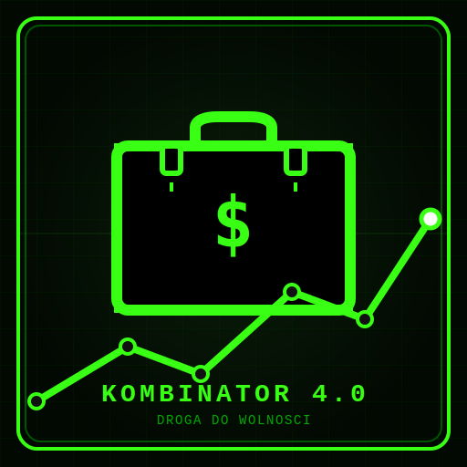

# 💼 Kombinator 4.0: Droga do Wolności

<p align="center">
  
</p>

<p align="center">
  <strong>Retro gra strategiczno-idle o polskiej transformacji ustrojowej, dzikim kapitalizmie i pułapkach finansowych.</strong>
</p>

<p align="center">
  <a href="https://github.com/NightBossman/kombinator-idle/blob/main/CHANGELOG.md">
    
  </a>
  
  
</p>

---

## 📖 O grze
**Kombinator 4.0: Droga do Wolności** to wciągająca, wielowątkowa gra typu idle/management z unikalnym klimatem historycznym. Wcielasz się w postać sprytnego kombinatora, który zaczyna od stania w kolejkach w czasach głębokiego PRL-u, by poprzez handel na bazarze w latach 90., giełdę GPW, ucieczki podatkowe i deweloperkę w latach 2000., zmierzyć się z Wielkim Kryzysem Finansowym 2008 roku.

Gra łączy w sobie mechaniki przyrostowe z zaawansowaną ekonomią, zarządzaniem ryzykiem i dynamicznymi wydarzeniami historycznymi inspirowanymi Polską przełomu wieków.

---

## 🎮 Ery i Główne Mechaniki

### 1. ☭ Czasy PRL (Początek drogi)
*   **Stanie w Kolejkach**: Spekuluj towarem, kupuj za talony w Pewexie, handluj kartkami.
*   **Partia & Opozycja**: Wybierz swoją drogę awansu – wkup się w łaski PZPR lub buduj wpływy w podziemnej Solidarności.
*   **Przemyt Towarów**: Organizuj przemyt deficytowych dóbr ze Wschodu i Zachodu.

### 2. 💸 Lata 90. (Dziki Kapitalizm)
*   **Bazar**: Handluj swetrami z Turcji i elektroniką z Tajwanu.
*   **GPW & NFI**: Kupuj i sprzedawaj akcje na Warszawskiej Giełdzie Papierów Wartościowych. Zarządzaj sprywatyzowanymi państwowymi fabrykami w ramach Narodowych Funduszy Inwestycyjnych.
*   **Mafia i Miasto**: Rekrutuj gangsterów z Pruszkowa i Wołomina, zdobywaj kontrolę nad warszawskimi dzielnicami, ściągaj haracze i broń swoich biznesów.
*   **Denominacja Złotego**: Zmierz się z galopującą hiperinflacją i zorganizuj wielką denominację waluty (skreślenie 4 zer!).

### 3. 🏗️ Lata 2000. (Integracja i Dotacje)
*   **Dotacje Unijne**: Pisz wnioski o dotacje z UE, ryzykując kontrole z OLAF i Urzędu Skarbowego.
*   **Portal Internetowy**: Rozwijaj startupy z ery dot-comów, dbaj o serwery i zarabiaj na reklamach AdSense.
*   **Zmywak UK**: Po wejściu do UE wyślij rodaków do pracy w Londynie i inkasuj prowizję w funtach (GBP).
*   **Deweloperka & Franki (CHF)**: Buduj mikroapartamenty za gotówkę lub zaciągaj kredyty we frankach szwajcarskich o zmiennej stopie procentowej.

### 4. 📉 Faza T: Wielka Recesja 2008 (Najnowsze)
*   **Frankowa Pułapka**: Upadek Lehman Brothers drastycznie winduje kurs franka (nawet do 7.20 PLN/CHF), paraliżując spłaty kredytów.
*   **Opcje Walutowe**: Zabezpieczaj swoje finanse poprzez spekulacyjne kontrakty PUT i CALL, unikając asymetrycznych "toksycznych opcji".
*   **Licytacje u Syndyka**: Wykorzystaj kryzys i odkupuj za bezcen niedokończone budowy upadających deweloperów.
*   **Doradcy Bankowi & Restrukturyzacja**: Wynajmuj doradców do negocjacji rat lub spłać dług na karnych warunkach stabilizacyjnych.

---

## ⚡ Cechy Techniczne i Wizualne
*   **Retro CRT Stylistyka**: Interfejs gry stylizowany na monochromatyczny terminal komputerowy z charakterystycznym efektem zakłóceń i migotania ekranu.
*   **Live Cashflow Dashboard**: Wbudowany kalkulator **Casio fx-3600P** z trybem szczegółowym pozwalającym analizować zyski i straty pasywne (upkeep gangów, raty kredytowe, przychody z biznesów) co do grosza.
*   **Tryb Deweloperski**: Panel ustawień z możliwością odblokowania er do celów testowych i przywracania pierwotnego stanu gry jednym kliknięciem (Backup & Restore).

---

## 🛠️ Instalacja i Uruchomienie

### Wymagania:
*   [Node.js](https://nodejs.org/) (wersja 16 lub nowsza)
*   Narzędzie pakietów `npm`

### Klonowanie repozytorium:
```bash
git clone https://github.com/NightBossman/kombinator-idle.git
cd kombinator-idle
```

### Instalacja zależności:
```bash
npm install
```

### Uruchomienie serwera deweloperskiego:
```bash
npm run dev
```
Gra będzie dostępna pod adresem: `http://localhost:5173/` (lub kolejnym wolnym porcie).

---

## 📊 Wersjonowanie i Zmiany
Projekt przestrzega zasad semantycznego wersjonowania. Pełną listę zmian, wydań oraz poprawek błędów (w tym naprawę krytycznego błędu inflacji po denominacji) znajdziesz w pliku [CHANGELOG.md](CHANGELOG.md).

---

<p align="center">
  <i>Stworzone z pasją w klimacie polskiego kapitalizmu przełomu wieków.</i>
</p>
