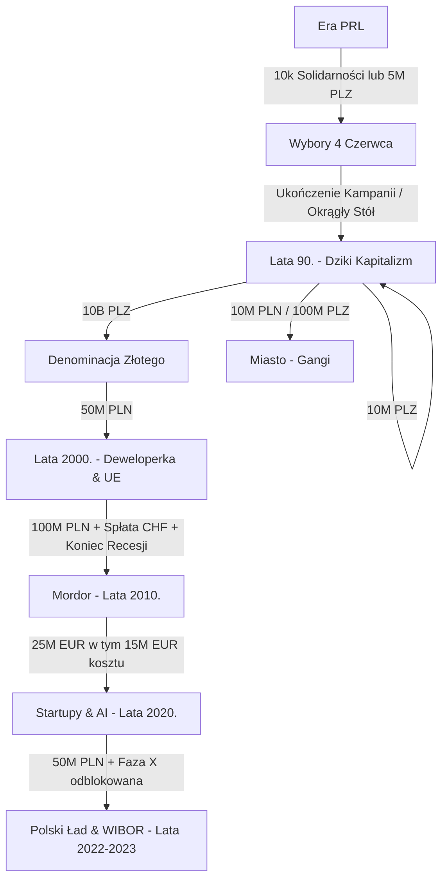

# Wymagania Odblokowania Sekcji i Faz Gry

Ten dokument zawiera pełny wykaz wymagań i kosztów niezbędnych do odblokowania poszczególnych zakładki, mechanik oraz kolejnych er historycznych (faz) w grze **Kombinator Idle**.

---

## 1. Podstawowe Zakładki (Dostępne od Początku)

Te sekcje są dostępne natychmiast po uruchomieniu nowej gry w erze PRL:

| Zakładka | Opis | Wymagania |
| :--- | :--- | :--- |
| **Praca / Kolejka** | Podstawowe klikanie, stanie w kolejkach i pasywni stacze. | Brak (dostępna od startu) |
| **Bazar / Cinkciarz** | Handel towarami bazarowymi i wymiana walut (USD). | Brak (dostępna od startu) |
| **Przemyt / Biznes** | Przemyt lądowy (auta), morski (Port Gdynia & Balaton) oraz spółki. | Brak (dostępna od startu) |
| **Partia / Opozycja** | Kariera w PZPR, drukowanie bibuły i wspieranie Solidarności. | Brak (dostępna od startu) |
| **Odznaczenia** | Kupowanie i aktywacja prestiżowych odznaczeń (nowa gra+). | Brak (dostępna od startu) |

---

## 2. Ukryte Sekcje i Mechaniki (Era PRL)

Niektóre mechaniki wymagają wykonania określonych akcji w grze lub zgromadzenia funduszy:

### 🪙 Czarny Rynek
- **Wymagania:** Odblokowuje się automatycznie (pasywnie), gdy stan Twojego konta w gotówce osiągnie co najmniej **1 000 PLZ**.
- **Efekt:** Umożliwia handel unikalnymi towarami i bronią za dolary.

### 🏢 Spółki Nomenklaturowe
- **Lokalizacja:** Zakładka *Przemyt / Biznes* -> podzakładka *Spółki Nomenklaturowe*.
- **Wymagania:** Rejestracja pierwszej spółki: **Pol-Hun Co. (Huta Katowice)**.
- **Koszt:** **10 000 000 PLZ**.

### 🇨🇭 Konta Zagraniczne (Offshore)
- **Wymogi widoczności przycisku w menu:**
  - Posiadanie rangi w partii co najmniej **Sekretarz** LUB odblokowana przynajmniej jedna *Spółka Nomenklaturowa* LUB posiadanie aktywnego *Szwajcarskiego Konta*.
- **Koszt założenia konta w Vaduz:**
  - **250 000 PLZ** LUB **5 000 USD**.

### 🕶️ Syndykat Eksportowy (Embargo COCOM)
- **Wymogi widoczności zakładki:**
  - Posiadanie zarejestrowanej *Spółki Nomenklaturowej* LUB odblokowanego *Szwajcarskiego Konta*.
- **Koszt aktywacji:** Bezpłatny (wymaga kliknięcia przycisku "Załóż Syndykat" w zakładce).

---

## 3. Kamienie Milowe i Przejścia do Nowych Er (Fazy)

Przejście do kolejnych dekad wymaga spłaty określonych zobowiązań i posiadania znacznego kapitału.

### 🗳️ Wybory 4 Czerwca (Faza K)
- **Wymogi widoczności zakładki:** Punkty Solidarności osiągnęły co najmniej **10 000** LUB została wykupiona Faza K.
- **Koszt odblokowania:** 
  - **Darmowe** (jeśli masz co najmniej 10 000 punktów Solidarności).
  - **5 000 000 PLZ** (jeśli nie posiadasz wymaganych punktów).

### 📈 Lata 90. (Dziki Kapitalizm - Faza M)
- **Wymogi widoczności zakładki:** Ukończenie kampanii wyborczej (Debata i Okrągły Stół) LUB posiadanie gotówki na zakup Fazy M.
- **Koszt odblokowania:** **10 000 000 PLZ**.
- **Efekt:** Odblokowuje pełną zakładkę *Lata 90.* (Ustawa Wilczka, Bazar, prywatyzacja NFI, wolne media) oraz giełdę **GPW**.

### 🔫 Miasto (Szara Strefa & Gangi - Faza N)
- **Wymogi widoczności zakładki:** Odblokowane *Lata 90.*.
- **Koszt odblokowania:** 
  - **100 000 000 PLZ** (przed denominacją).
  - **10 000 PLN** (po denominacji).
- **Efekt:** Odblokowuje zakładkę *Miasto (Gangi)* pozwalającą na rekrutację gangsterów, ochronę przed haraczami Pruszkowa i czarnorynkowy handel bronią.

### 💸 Denominacja Złotego
- **Lokalizacja:** Dostępna jako akcja w zakładce *Lata 90.*.
- **Koszt:** **10 000 000 000 PLZ** (10 Miliardów starych złotych).
- **Efekt:** Przelicza gotówkę w stosunku 10 000:1 (obcina 4 zera), likwiduje mnożnik hiperinflacji cen i pozwala na dalszy postęp do lat 2000.

### 🌐 Lata 2000. (Wejście do UE i Dot-Com - Faza S)
- **Wymogi widoczności zakładki:** Odblokowane *Lata 90.*.
- **Koszt odblokowania:** 
  - Wymagana przeprowadzona **Denominacja** ORAZ posiadanie **50 000 000 PLN** (nowych złotych).
- **Efekt:** Odblokowuje zakładkę *Lata 2000.* (portal Dot-Com, dotacje unijne, budowa mieszkań i kredyty we frankach CHF).

### 🏢 Mordor (Outsourcing i Korporacje - Faza W)
- **Wymogi widoczności zakładki:** Odblokowane *Lata 2000.*.
- **Koszt odblokowania:** 
  - Posiadanie **100 000 000 PLN** gotówki.
  - Spłacony w całości kredyt we frankach szwajcarskich (**CHF Debt = 0**).
  - Brak aktywnej Recesji 2008 (Kryzysu Real Estate).
- **Efekt:** Odblokowuje zakładkę *Mordor (2010.)* (zarządzanie biurem BPO na Domaniewskiej, zatrudnianie pracowników w euro, obligacje skarbowe).

### 🚀 Startupy (Era AI i Krypto - Faza X - Opcja A)
- **Wymogi widoczności zakładki:** Odblokowany *Mordor (2010.)*.
- **Koszt odblokowania:** 
  - Posiadanie co najmniej **25 000 000 EUR** na kontach walutowych.
  - Koszt wejścia: **15 000 000 EUR** (pozostałe 10M EUR zostaje na Twoim koncie).
- **Efekt:** Odblokowuje zakładkę *Startupy (2020.)* (koparki kryptowalut RTX/ASIC, kurs BTC, giełda KombinatorCoin pod lupą KNF oraz software house trenujący modele AI).

### 📉 Polski Ład & WIBOR (Kryzys Energetyczny - Faza Y - Opcja B)
- **Wymogi widoczności zakładki:** Odblokowana *Faza X (Startupy)*.
- **Koszt odblokowania:** **50 000 000 PLN** gotówki w PLN.
- **Efekt:** Odblokowuje zakładkę *Polski Ład (2022-2023)* (podatki Polskiego Ładu, kredyt obrotowy PLN powiązany ze stopami WIBOR, ryzyko Urzędu Skarbowego, amortyzację przez biura rachunkowe oraz zasilanie farmami wiatrowymi obniżającymi potrojone rachunki za prąd w kryzysie energetycznym).

### 🤖 Faza Z: Era AI i KPO (Lata 2024+)
- **Wymogi widoczności zakładki:** Odblokowana *Faza Y (Polski Ład)*.
- **Koszt odblokowania:** **500 000 000 PLN** gotówki w PLN.
- **Efekt:** Odblokowuje zakładkę *Faza Z (2024+)* (Krajowy Plan Odbudowy, usługi AI SaaS generujące przychody w USD i EUR, posiedzenia RPP aktualizujące inflację i oprocentowanie WIBOR, oraz detaliczne obligacje skarbowe chroniące przed inflacją).
